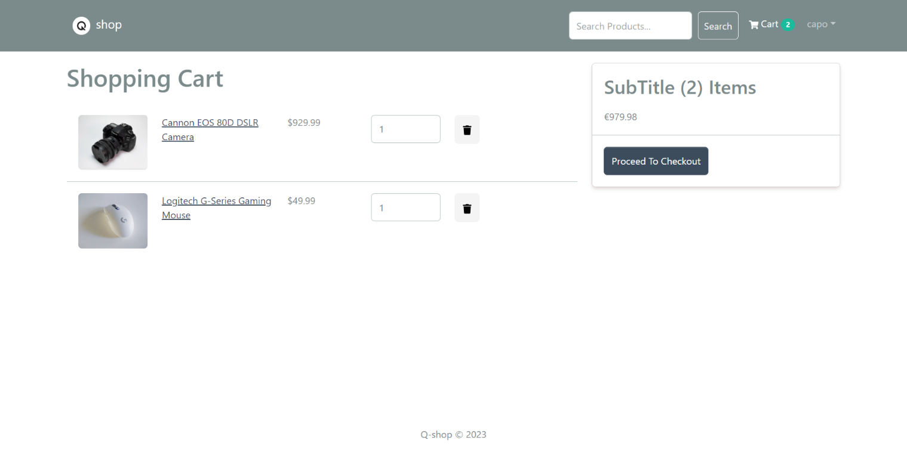

# Q-Shop eCommerce Platform

> eCommerce platform built with the MERN stack & Redux.





## Features

- Full featured shopping cart
- Product reviews and ratings
- Top products carousel
- Product pagination
- Product search feature
- User profile with orders
- Admin product management
- Admin user management
- Admin Order details page
- Mark orders as delivered option
- Checkout process (shipping, payment method, etc)
- PayPal / credit card integration
- Database seeder (products & users)

## Usage

- Create a MongoDB database and obtain your `MongoDB URI` - [MongoDB Atlas](https://www.mongodb.com/cloud/atlas/register)
- Create a PayPal account and obtain your `Client ID` - [PayPal Developer](https://developer.paypal.com/)

### Env Variables

Rename the `.env.example` file to `.env` and add the following

```
NODE_ENV = development
PORT = 5000
MONGO_URI = your mongodb uri
JWT_SECRET = your secret
PAYPAL_CLIENT_ID = your paypal client id
PAGINATION_LIMIT = add any limit you like
```

### Install Dependencies (frontend & backend)

```
yarn
cd frontend
yarn
```

### Run

```

# Run frontend (:3000)
cd frontend
yarn start

 # Run backend (:5000)
yarn run server

# Run both frontend & backend with one command
npm run dev
```

## Build & Deploy

```
# Create frontend prod build
cd frontend
npm run build
```

### Seed Database

You can use the following commands to seed the database with some sample users and products as well as destroy all data

```
# Import data
yarn run data:import

# Destroy data
yarn run data:destroy
```

```
Sample User Logins

admin@email.com (Admin)
123456

john@email.com (Customer)
123456

jane@email.com (Customer)
123456
```